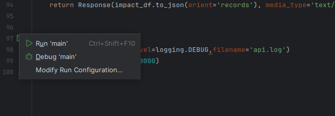

# Multi-Impact Electricity modelling using live data sources
Estimate real-time environmental impacts using electricity generation data reported by national and super-national bodies

# Set up
1. Create an ENTSO-E account and request an API key
2. Decide on a place to run a database and [setup postgres](https://www.postgresql.org/docs/current/tutorial-install.html). 
3. Create an empty database called `electricity_lca` and create a user account with privilege to create tables on the database
4. Clone this repository
5. Copy `template_project.env` to a new file `.env` and fill the copied file with `ENTSOE_SECURITY_TOKEN` = your ENTSOE security token. Fill the connection details to your postgres sql instance
6. Create virtual environment
```commandline
venv create elec_lca_venv
```
7. Install requirements
```commandline
pip install -r requirement.txt
```
7. Run `python src/setup/setup.py` to initalize the database schema and load static data 
8. Run all tests under `tests/`

# Set up database
Run 
```commandline
python src/setup/setup.py
```
> This creates the tables in the database and fills the constant value (e.g. environmental impacts, regions, electricity generation types)
> using the data in the `data/` directory

# Run ETL pipeline
1. Ensure that you have set the .env file (or environment values) correctly, including an ENTSO-E security token authorized to access the ENTSO-E API
2. Set the start date and end date that you wish to retrieve data for in main()
3. Run the pipeline
```commandline
python src/pipelines/retrieve_from_entsoe.py -s 20240101 20240301
```

# Start microservice and dashboard
## Running directly
1. Run `launch.sh` (on linux)
## Running via Docker
```commandline
docker image build . -t elec_lca_microservice:latest
```
then
```commandline
docker container run -d --rm -p 8000:8000 -p 8900:8900 -p 25060:25060 elec_lca_microservice:latest
```
This should start a web browser showing a dashboard on localhost:8900

# Task Orchestration
Task orchestration is done via Airflow. Airflow is a task orchestration service written in Python

    Airflow requires sqlalchemy<2, which messes up the pipelines it is supposed to run.
    TODO: Figure out a solution

~~## Setup Airflow~~
1. With the venv environment activated (see above), run the following
```shell
export AIRFLOW_HOME=${PWD}/airflow
```
2. Iniate Airflow database
```shell
airflow db init
```
3. Create a folder for dags
```shell
mkdir -p ${AIRFLOW_HOME}/dags/
```

## Retrieving data from ENTSO-E using Airflow
1. Launch Airflow 
```commandline
airflow standalone
```
2. Visit `localhost:8080` to view the Airflow dashboard 

# Data sources
## Environmental data
1. UNECE. _“Life Cycle Assessment of Electricity Generation Options | UNECE.”_ Accessed December 5, 2023. https://unece.org/sed/documents/2021/10/reports/life-cycle-assessment-electricity-generation-options.

##  Electricity data
1. ENTSO-E, for electricity generation data from European member states and electricity regions
2. Ember Global Monthly Data from https://ember-climate.org/data/data-catalogue/

See references for further

# Data Engineering Rational and Design Choice
## DevOps - GitHub and Pytest
- Repository code: https://github.com/tur-ium/electricity_lca (contact Artur for access)
- Standardization - cookiecutter data science template, `pandera` for ensuring conformance of data to expectations, table-level SQL constraints to perform validity checks
- Unit / integration testing : Pytest
- ETL - Python + pandas (with pyArrow)

## Database - Postgres
Data comes in tabular format => tabular relational database not Mongo / other document-oriented database

Reviewed common RDBMS’s : MySQL, SQLite, Microsoft SQL server, and Postgres. Decided for Postgres, based on the satisfaction of all project requirements
  - Free, open source, trustworthy and widely used
  - SQL standard conformity, functionality, and ease of use
  - Strong software ecosystem Support across cloud platforms, management tooling  (e.g. SQL Alchemy and pgAdmin)

Database schema and ORM managed using SQL Alchemy

Database initialized by running one python script -> create_database.py

## Cloud Platform - AWS
- Google Cloud Platform - Benefits: scale storage separate from db compute. Drawbacks: complex to connect to local dev env, limited trial, obscure pricing
- Saturn Cloud (https://saturncloud.io/) - only 10 free hours
- DeepNote - only support Jupyter Notebooks
- PythonAnywhere - benefits: ease-of-use, supports cron jobs, sharing shells, free tier. Drawbacks: not free to use postgres
- Amazon Web Services - 12 month free trial includes all required functionalities, good practical experience, scalable. Drawback - monopolized, vendor lock-in, limited trial

# Application structure
1. Simple extraction scripts (for extracting data from csvs for example), can be found in `src/extract`
2. ETL (extract-transform-load) pipelines that retrieve, process and store data into a database (or other data storage system) can be found in the `src/pipelines/` folder
3. ORM layer (src/orm) uses sqlalchemy `declarative_base` to provide an object-orientated interface for accessing and manipulating objects in the database.
4. A microservice that provides an api interface for the solution can be found in `src/microservice`
5. Dashboard providing a visual interface can be found in `src/visualization/main.py`

The microservice runs continuously in the background and receives requests from the dashboard when need to retrieve new data from the database or calculate fresh environmental impacts. 

A high level illustration of the components looks like this:


# Debugging
- You can debug the microservice (src/microservice/main.py) by debugging the main() function. Screenshot from PyCharm below

- You can debug the StreamLit application in PyCharm using the `Debug Streamlit.run.xml` in the `.run` folder. Note that the microservice must be running [more info in this video](https://youtu.be/IFAmwYZC3eA?feature=shared)

# Acknowledgements
- This is a project undertaken as part of training for the _Data Engineering_ course run by [DataScientest](https://datascientest.com/) from August 2023 - July 2024. Concepts from the course have been applied where relevant to the project.
- The [data science cookiecutter template](https://github.com/drivendata/cookiecutter-data-science.git) by [DrivenData](https://www.drivendata.org/) for the starting structure for the project
- Last but not least my coach Gregor Wernet for the initial motivation for this project.